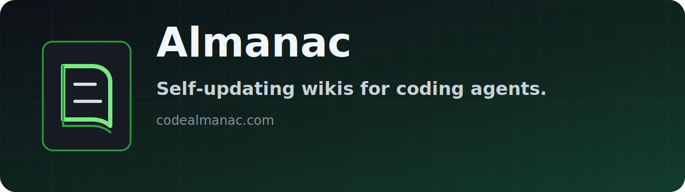

# Almanac

**Self-updating wikis for coding agents.**

[Almanac](https://codealmanac.com) is a self-updating wiki for your coding agents.

## What Almanac does

- Keeps codebase knowledge in a wiki agents can read while they work
- Captures decisions, flows, invariants, incidents, and gotchas that do not live cleanly in code
- Helps coding agents start with context instead of rediscovering the repo each time

## Start here

- [Install the CLI](https://github.com/AlmanacCode/codealmanac)
- [Star `codealmanac`](https://github.com/AlmanacCode/codealmanac)
- [Visit the website](https://codealmanac.com)
- Join Discord: coming soon

## Main repository

- [codealmanac](https://github.com/AlmanacCode/codealmanac): self-updating codebase wikis for coding agents.
